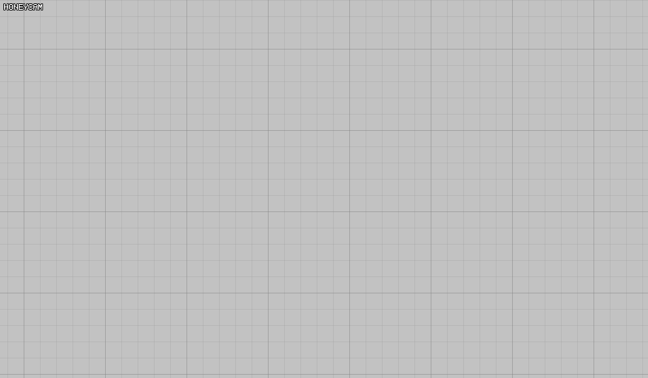
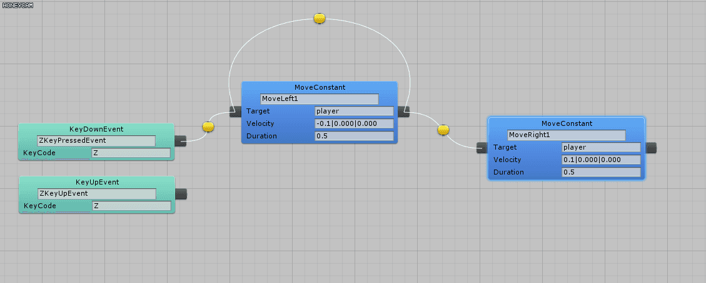

# CurrentEditor

A visual programming tool for Unity3D.

The main concept of this project is to think **every** code in a project as a coroutine.
I created this tool to program a game that builds a strong relation between visual and audio events. (i.e., 140 by Jeppe Carlsen)

## Usage

It is a visual programming tool.

Download the project, and refer to `manual/index.html`.

## Discussion

This is an experimental project. To test the effectiveness of this workflow, I and other members in my game-making club GPos tried this tool to create a script for building a audio-synced bullet hell game.

This tool proved to be effective when coding the specific scenario, but I think the visual coding may get messy a lot when other games.

The simplest way to improve this tool would be to actively use this framework to complete a complete game. Eating dogfood is what I want to do, but right now I'm focusing more on computer graphics.

The project is currently stoppted and may not work with recent versions of Unity3D.
